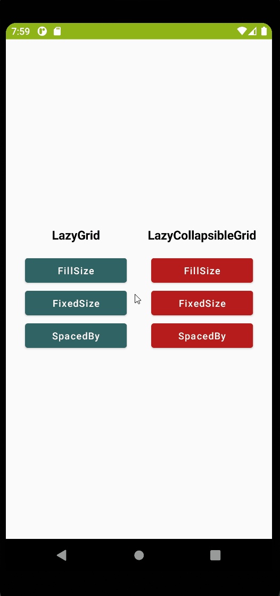

# LazyGrid
[](https://jitpack.io/#yusufarisoy/lazy-grid)

<br>
LazyGrid library for [Jetpack Compose](https://developer.android.com/jetpack/compose).

## Demo
### FillSize
All items of row shares the full width equally without any spaces.
| LazyGrid | LazyCollapsibleGrid |
| ------ | ------ |
|  |  |

### FixedSize
Items placed with a fixed width and spaced equally according to remaining space.
| LazyGrid | LazyCollapsibleGrid |
| ------ | ------ |
|  |  |

### SpacedBy
Items spaced by a fixed space and share the remaining width equally.
| LazyGrid | LazyCollapsibleGrid |
| ------ | ------ |
|  |  |

## Setup
### Gradle
```
allprojects {
    repositories {
        ...
        maven { url 'https://jitpack.io' }
    }
}

dependencies {
    implementation 'com.github.yusufarisoy:lazy-grid:1.0.0'
}
```

### Compsable
```
LazyColumn(modifier = Modifier.fillMaxSize()) {
    LazyGrid(
        rows = listOf(),
        elementPerRow = 4,
        itemPlacementType = ItemPlacementType.FixedSize(itemWidth = 80.dp),
        contentPadding = PaddingValues(horizontal = 16.dp)
    ) { item, modifier ->
        CustomGridItem(item, modifier)
    }
    
    // Collapsible
    var isExpanded by remember { mutableStateOf(false) }
    
    LazyCollapsibleGrid(
        rows = listOf(),
        collapsibleRows = listOf(),
        elementPerRow = 3,
        itemPlacementType = ItemPlacementType.SpacedBy(space = 16.dp),
        contentPadding = PaddingValues(horizontal = 16.dp),
        isExpanded = isExpanded,
        enterTransition = expandVertically(),
        exitTransition = shrinkVertically(),
        collapseButton = { CustomCollapseButton(onClick = { isExpanded = !isExpanded }) }
    ) { item, modifier ->
        CustomGridItem(item, modifier)
    }
}
```